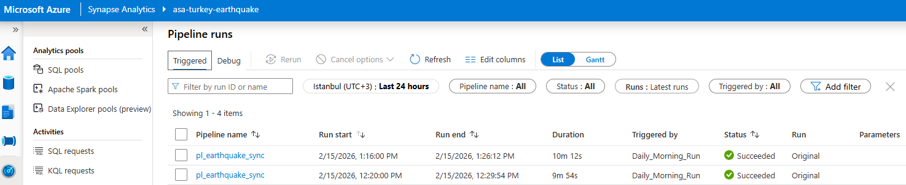
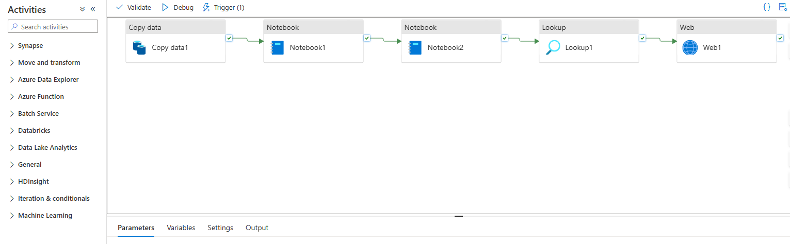
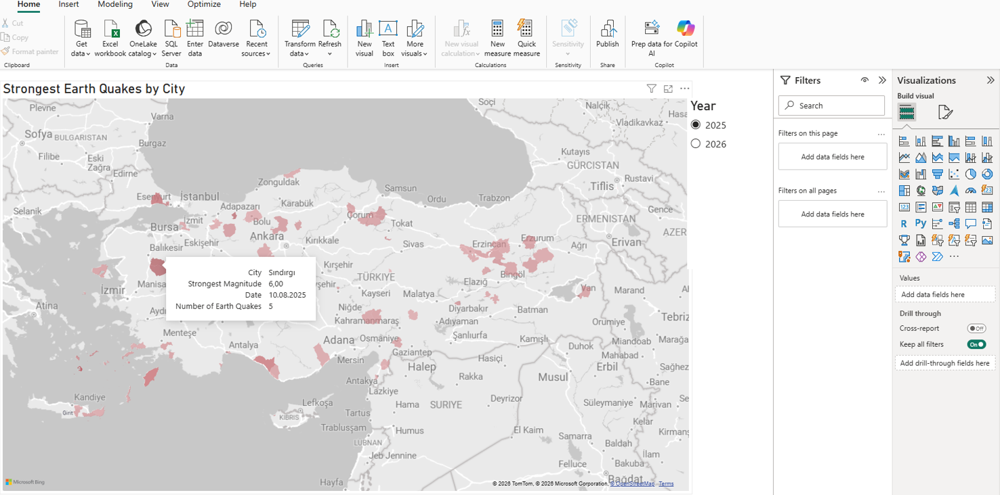

# azure-seismic-data-pipeline
End-to-end Azure-based seismic data analytics pipeline with automated ingestion, transformation, visualization, and alerting.

Automated End-to-End Seismic Data Analytics Pipeline

Built on Azure Synapse Analytics

1. Executive Summary

This project implements an end-to-end, fully automated seismic data analytics pipeline focused on earthquakes in Turkey. The system ingests earthquake data from a public API, processes and enriches it through multiple transformation layers, and delivers up-to-date analytical views to Power BI.
The pipeline is designed to be reliable, scalable, and transparent, ensuring that raw seismic data can be traced through each processing stage while enabling timely insights and automated notifications for significant events.

2. System Architecture and Technology Stack

The solution follows a cloud-native, decoupled architecture to separate orchestration, compute, storage, and consumption layers:

Data Orchestration
Azure Synapse Pipelines are used for scheduled and parameterized workflows, managing ingestion, transformation, validation, and downstream triggering.

Distributed Processing
Apache Spark pools handle data cleansing, schema normalization, enrichment, and aggregation at scale.

Data Storage
Azure Data Lake Storage Gen2 serves as the central persistence layer, using hierarchical namespaces and a layered folder structure.

Data Serving
A Serverless SQL Pool provides virtualized access to curated datasets without duplicating data.

Notification Layer
Azure Logic Apps enables event-driven notifications based on pipeline outcomes and data conditions.

Visualization
Power BI connects via DirectQuery to ensure dashboards always reflect the latest processed data.

3. Data Engineering Lifecycle (Medallion Architecture)
Bronze Layer – Automated Ingestion

Seismic data is ingested using Synapse Copy Activity from the United States Geological Survey (USGS) REST API.
Requests are dynamically parameterized to filter events within Turkey’s geographical boundaries (latitude 35–43, longitude 25–45) and a minimum magnitude threshold of 2.5.
The raw responses are stored in their original GeoJSON format in the bronze layer to preserve a complete and auditable source of truth.

Silver Layer – Transformation and Standardization

A PySpark notebook processes the raw GeoJSON data by flattening nested structures, normalizing timestamps from epoch format to ISO 8601, and cleaning inconsistent fields.
Additional parsing logic extracts structured location information from free-text descriptions.
The refined output is written as Parquet files to the silver layer, optimized for analytical queries.

Gold Layer – Aggregation and Analytics

A second PySpark notebook performs aggregations across temporal and spatial dimensions.
The resulting datasets include daily and regional summaries such as earthquake frequency, average magnitude, and maximum observed intensity.
Data is written in a way that keeps storage and serving layers independent, allowing uninterrupted access during pipeline updates.

4. Data Serving and Alerting
Serverless SQL Views

Curated gold-layer datasets are exposed through Serverless SQL views using OPENROWSET over Parquet files. This approach enables efficient querying without copying or restructuring the underlying data.

Automated Alerting

After processing completes, the pipeline evaluates the results to identify significant seismic events based on predefined thresholds.
When such events are detected, metadata is sent via HTTP to an Azure Logic App, which automatically generates and sends formatted email notifications through the Outlook connector.
This ensures that important seismic activity is communicated promptly and reliably.

5. Visualization Approach

Power BI dashboards connect to the Serverless SQL endpoint using DirectQuery mode.
Any interaction, such as time filters or regional slicers, triggers live queries against the most recent gold-layer data.
As a result, visualizations always reflect the latest successfully processed earthquake information without manual refreshes.

## Pipeline Execution

## Data Serving Schema

## Power BI Visualization

